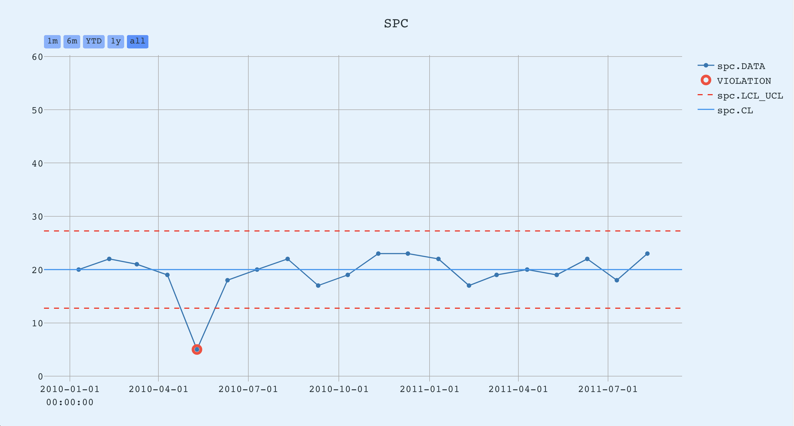
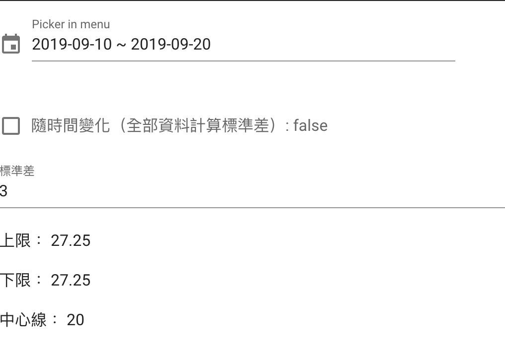

# spc

### 實作目標

 - 根據輸入標準差計算出，SPC管制上下限
 - 標準的計算區間可以，根據選擇日期範圍資料，或是全部計算
 - 美化(SPC chart 區域 + input 區域)排版，使其符合 UI/UX

### 而外目標
  - 加入 distribution 參考此 (https://plotly.com/javascript/spc-control-charts/#spc-control-chart-&-distribution)

### 參考資料
https://mymkc.com/article/content/23303

#### SPC chart 區域


#### input 區域


## Project setup
```
npm install
```

### Compiles and hot-reloads for development
```
npm run serve
```

### Compiles and minifies for production
```
npm run build
```

### Lints and fixes files
```
npm run lint
```

### Customize configuration
See [Configuration Reference](https://cli.vuejs.org/config/).
